# Orrery Harness — Architecture

2026-09-17 · @Someone

## Syllabus

| § | Section | Answers |
| --- | --- | --- |
| 1 | Objectives | What this is and why it exists |
| 2 | Current state | What Pi, Claude Code and Codex do today |
| 3 | Core architecture | Which components exist and how they talk |
| 4 | Component plan | What each component owns, with interfaces |
| 5 | Client/server protocol | How a client and the kernel communicate |
| 6 | UI management | How output reaches a screen |
| 7 | Fixed and customizable | Which level of each aspect users control |
| 8 | Build order | What to build, in what order |

## 1 · Objectives

Orrery Harness is a Rust agent runtime that an organisation configures into the coding agent it actually wants, without forking anything and without trusting arbitrary community code with its filesystem.

Scope is the harness alone. Orrery ADE is a future client of this runtime; no decision below depends on it.

Each objective answers a failure that exists today.

| # | Objective | Problem today |
| --- | --- | --- |
| 1 | Make the harness itself composable | You inherit a harness's opinions; nobody lets you assemble the loop |
| 2 | Isolate extensions from the process | Pi: a duplicate tool name exits 1; a transitive dependency breaks an unrelated extension |
| 3 | Make loading observable | No report of what loaded, failed or was skipped |
| 4 | Enforce permissions in the core | Pi ships none; Claude Code and Codex have config the agent runs inside, not a boundary extensions sit behind |
| 5 | Own tool I/O with hard budgets | Pi's read loads whole files before applying limits |
| 6 | Ship orchestration as primitives | Pi omits sub-agents by design, so every team rebuilds them differently |
| 7 | Pinned, auditable supply chain | Extension sources are unsigned and unpinned; no proof of what ran |
| 8 | One ecosystem across every surface | Extensions draw their own UI, so nothing ports between clients |
| 9 | Extend in any language | Every harness requires TypeScript proficiency |
| 10 | Benchmarks and evals built in | Teams write throwaway scripts and get numbers they can't reproduce |

## 2 · Current state

| Capability | Pi | Claude Code | Codex CLI | Orrery |
| --- | --- | --- | --- | --- |
| Extension model | TypeScript only, in-process | Plugins, hooks, MCP | Plugins, skills, apps, MCP | Any language, out of process |
| Extension isolation | None | None | None | Per-extension host |
| Tool namespacing | Flat, conflicts fatal | Flat per source | Flat per source | `ext.tool`, conflicts survivable |
| Permissions | None built in | allow/deny rules + hooks | Sandbox modes + approval policy | Capability grants in core |
| OS sandbox | User's problem | Sandbox setting | Seatbelt / Landlock / restricted-token | Core-enforced, per grant |
| Sub-agents | Not shipped | Yes, file-defined | Yes, TOML-defined | Core primitive |
| Hooks / lifecycle | Event handlers | \~14 lifecycle events | Hooks (beta) | Typed interceptors |
| Skills | `SKILL.md`, agentskills.io | `SKILL.md` via Skill tool | `SKILL.md` | Same spec, policy-scoped |
| MCP | Not used — skills instead | Client | Client + server | Client + server, brokered |
| Config layering | Global / project | Managed → user → project → local | Managed → user → profile → project | Managed → org → user → workspace → project |
| Enterprise controls | None | Managed settings, marketplace allowlist | `requirements.toml`, MCP allowlist | Signed registry + audit stream |
| UI surface | TUI, extension-drawn | TUI | TUI | AG-UI events, closed surface vocabulary, client-rendered |
| Benchmarks / evals | None | External tooling | External tooling | Built-in runner, cross-harness adapters |

## 3 · Core architecture

Ten components the kernel owns, plus the bricks an extension may replace (§4.7). The kernel owns the loop and every resource handle; everything else either advises the kernel or runs behind it.

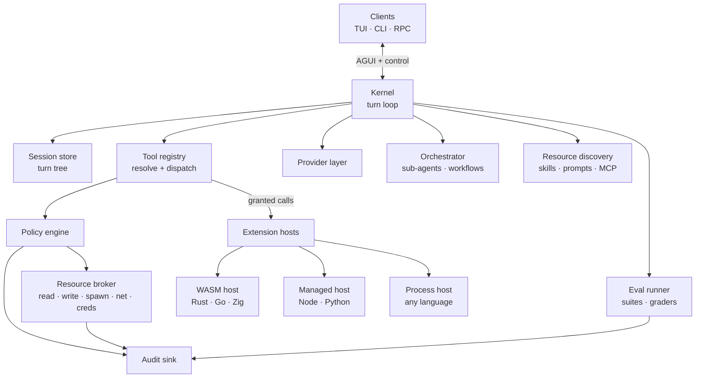

**Communication rules — these are the invariants:**

| From | To | Channel | Rule |
| --- | --- | --- | --- |
| Client | Kernel | Control RPC | Clients send intents, never state mutations |
| Kernel | Client | AG-UI events | Kernel pushes; clients render, don't interpret |
| Kernel | Tool registry | In-process call | Registry resolves `ext.tool` to a host |
| Registry | Policy engine | In-process, synchronous | Every call checked before dispatch, no exceptions |
| Policy | Resource broker | Capability token | Broker refuses any call without a live token |
| Registry | Extension host | JSON-RPC over pipe | One connection per extension, cancellable |
| Extension | Broker | Back through the host | Extensions never hold an fd, socket or secret |
| Anything | Audit sink | Append-only stream | Decisions logged whether allowed or denied |

The structural rule: **an extension has no capability except through a token the policy engine issued for that specific call.**

**One message, end to end.** The map above, walked once: a developer types a line in the composer and presses Enter. The first view is what moves in the client, the second what the kernel does with it.

**In the client.** The composer never talks to the kernel directly. It hands the text to the client session, which owns `seq` and the pending queue, so a dropped connection resumes instead of losing the turn.

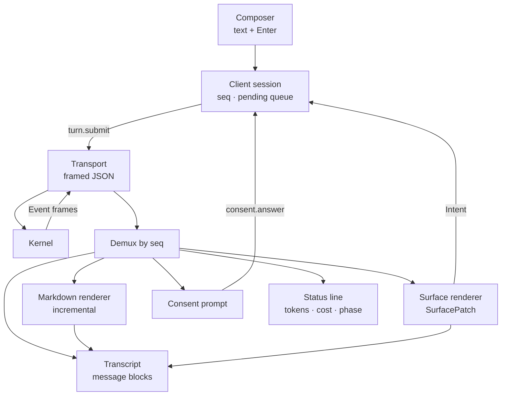

Every box below the demux renders frames it did not originate. None of them reaches the kernel except through the client session, which is what keeps the TUI, the web client and `--json` on one path.

**In the kernel.** One loop, run until the provider stops asking for tools.

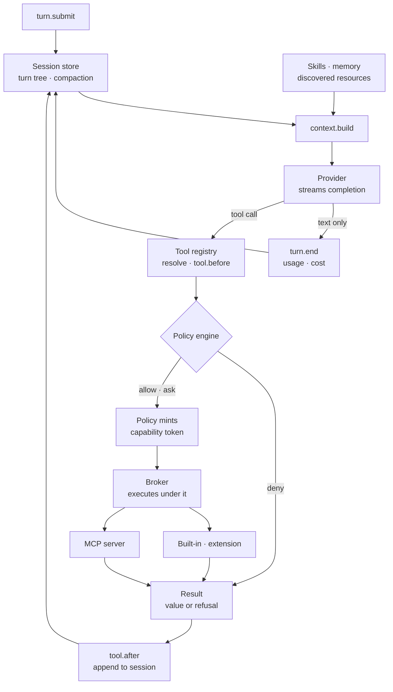

Two things enter from the side. Skills and discovered resources become context at `context.build`, and a bound memory provider contributes there too (§4.3). MCP is not a side door at all — one more dispatch target behind the same policy check. The turn tree stays canonical: whatever memory contributed is written into the turn as resolved content.

## 4 · Component plan

Each component below follows the same four beats: what it is, how it should work, what a user can override, and a diagram where the mechanism needs one. Interfaces are written in TypeScript for readability — the kernel is Rust, and these are the shapes the RPC schema serialises.

Every component obeys the same three rules:

1. **No ambient authority.** A component receives what it may touch as an argument. Nothing reaches for a global.
2. **Failure is local and reported.** A component can fail, degrade, or be disabled without ending the session, and every such event lands in the ledger.
3. **Declared before used.** Tools, capabilities, sub-agents, skills and MCP servers are all declared in a manifest the kernel reads before anything runs.

### 4.1 · Kernel

**What it is.** The owner of the turn. One loop: build context, call the provider, receive tool calls, dispatch them, append results, repeat until stop. Every other component in this section is something the kernel calls; none of them calls it back.

**How it should work.** Ten phases across three scopes, and a naming rule that tells you what each one can do: a **gate** (`.before`, `.after`, `.resolve`) may return a verdict that changes the outcome; a **span** (`.start`, `.end`) only brackets. A phase exists only where a verdict is possible — everything else that merely happened is an event on the stream (§4.12), which is why this list is ten rather than the thirty an event bus accumulates.

Interceptors are typed decisions rather than free-form shell commands, and they return a verdict without doing I/O: a `handled` result must come from data the interceptor already holds, never from a fresh read. An interceptor that needs the disk asks for a tool like anything else and takes the same policy check. A `deny` verdict narrows — it can refuse a call the policy engine would have allowed, never allow one the policy engine refused.

```ts
type Phase =
  // session scope
  | "session.start"                                   // amend the resolved manifest, trust
  // turn scope
  | "turn.start" | "turn.end"
  // pass scope
  | "context.build" | "context.compact"
  | "provider.before" | "provider.after"
  | "tool.resolve" | "tool.before" | "tool.after";

interface Interceptor {
  phase: Phase;
  match?: { tool?: string; agent?: string };
  // Deterministic: returns a decision, performs no I/O.
  run(ctx: InterceptCtx): Promise<
    | { action: "continue" }
    | { action: "rewrite"; value: unknown }
    | { action: "deny"; reason: string }
    | { action: "handled"; result: ToolResult }>;   // from data already held
}

// Scope boundaries, not phases: may do I/O through the broker, returns nothing,
// so it cannot alter the turn it fires on. Where memory writes (§4.3).
interface LifecycleHandler {
  at: "session.start" | "session.end" | "turn.end" | "branch.close" | "workflow.end";
  run(ctx: LifecycleCtx): Promise<void>;
}
```

`session.start` appears in both lists on purpose: an interceptor there returns a verdict on the resolved manifest, a lifecycle handler there does the I/O of opening a store. The pass itself is deliberately unnamed — it is a unit of accounting, so every event carries a `passId`, but no decision sits at a pass boundary that `context.build` and `provider.after` do not already cover.

**Can the user override it?** The phase set and their order are ours — nothing reorders the loop. What runs at each phase is the user's: extensions register interceptors with a `match` on tool or agent, and a profile names which are active. Two limits hold regardless: an interceptor cannot skip the policy check, and every `deny` or `handled` verdict lands in the audit stream.

### 4.2 · Session

**What it is.** History, and the only place it lives. A turn tree rather than a flat transcript: branches for sub-agents, retries and speculative work, persisted per turn so a crash loses at most one turn.

**How it should work.** Four operations, and everything else is built on them. `append` records a turn, `branch` forks one, `materialise` renders a branch into messages under a token budget, `compact` shrinks a branch. The tree is canonical — what the model sees is derived from it on every pass and never kept beside it, which is what makes a session replayable and a failed eval case openable.

```ts
interface SessionStore {
  append(turn: Turn): Promise<TurnId>;
  branch(from: TurnId, label: string): Promise<BranchId>;   // sub-agents, retries
  materialise(branch: BranchId, budget: TokenBudget): Promise<Message[]>;
  compact(branch: BranchId, strategy: CompactStrategy): Promise<CompactResult>;
}
```

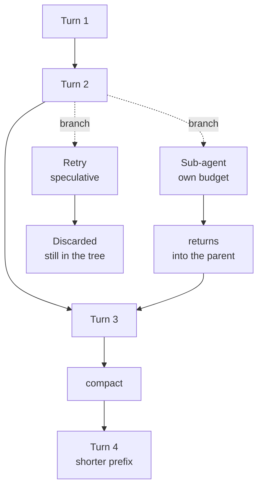

A branch is made of ordinary turns, so a sub-agent's work stays inspectable in the same transcript instead of collapsing into one tool result, and an abandoned retry is still there to look at.

**Can the user override it?** The tree shape, per-turn persistence and `seq` ordering are ours: a client never writes a turn, it asks the kernel to. Where branches are taken, how they are labelled and which session a client attaches to are the user's.

**Concurrency.** One turn at a time per branch; parallel work always means parallel *branches*. `append` is serialised per branch, so two sub-agents running at once never interleave into one prefix, and their results merge into the parent only when each branch closes. A second `turn.submit` on a branch with a live turn is refused with a typed error rather than queued invisibly — a client that wants a queue keeps it on its side, where the user can see it.

### 4.3 · Memory

**What it is.** A pluggable layer, and the only component in this section we do not implement ourselves. Memory is whatever an extension chooses to carry across passes, turns or sessions. Everyone has a flavour, so the kernel owns the scoping, lifetime and visibility rules and an extension owns the store, the content and the retrieval strategy.

**How it should work.** Three parts: scopes whose lifetimes the kernel already manages, a recall contributor called during `context.build`, and lifecycle handlers that may do I/O at scope boundaries.

A scope is a handle on something the kernel already creates and destroys, never a free-form label, so lifetime and cleanup come for free.

| Scope | Lives as long as | Cleared at |
| --- | --- | --- |
| `global` | the install | an explicit `forget` |
| `workspace` · `project` | the config layer it sits in | the folder leaves the config set |
| `session` | one session | `session.end` |
| `workflow` | one declared run | the workflow's budget closing |
| `branch` | a sub-agent or a retry branch | the branch, discarded ones included |
| `turn` | one user turn | `turn.end` |

A sub-agent's notes dying with its branch is the case that earns the design: nobody writes cleanup code, and an abandoned retry leaves no residue.

Reads and writes enter through different doors, and the split is not cosmetic. Interceptors are deterministic and do no I/O — that is what makes the loop replayable — so memory never writes from inside the loop. It writes from **lifecycle handlers**: a second kind of extension entry point that runs at a scope boundary, may reach the broker, and returns nothing, so it cannot change the turn it fires on.

```ts
type MemScope =
  | "global" | "workspace" | "project"
  | "session" | "workflow" | "branch" | "turn";

interface MemoryProvider {
  id: string;
  // Contributes to context.build, alongside skills, under a profile allowance.
  recall(q: { scope: MemScope[]; query: string; budget: TokenBudget }): Promise<MemEntry[]>;
  write(scope: MemScope, entry: MemEntry): Promise<void>;      // lifecycle handlers only
  forget(scope: MemScope, selector: MemSelector): Promise<number>;
}

interface LifecycleHandler {
  at: "session.start" | "session.end" | "turn.end" | "branch.close" | "workflow.end";
  // May perform I/O through the broker. Returns nothing: it cannot alter the turn.
  run(ctx: LifecycleCtx): Promise<void>;
}
```

Zero or many providers can be active. `recall` runs during `context.build` under a token allowance set by the profile, and what comes back is clipped to it: memory shares the window with history, and a chatty provider must not quietly evict the transcript.

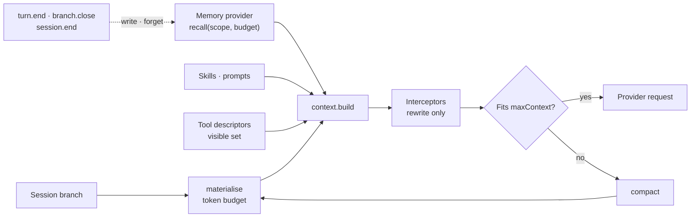

**Assembly order is fixed, and the reason is cost.** Stable prefix first — system prompt, agent, tool descriptors, skills — then the volatile suffix: recalled memory, history, current input. Providers that advertise `cache` key on a prefix, so anything changing per pass sits behind everything that does not. A memory provider injecting near the top would invalidate the cache every pass.

Nothing reaches the model without passing `context.build`, which is why the visible tool set, the active skills and anything recalled are settled there rather than at the provider.

**Two rules that are not negotiable.** Visibility copies §4.10's sub-agent rule: read down your own chain, never across siblings, never write to a scope wider than the one you run in — otherwise a sub-agent denied `write` puts a secret in `global` for its parent to read back. And whatever memory injected is recorded in the turn as resolved content, never as a pointer: the store moves on, and the tree still has to show what the model saw.

**Can the user override it?** Nearly all of it — this layer exists to be replaced. Ours: the scope set and their lifetimes, the visibility rule, the token clamp, and the rule that recalled content is recorded. Theirs: the store, the retrieval strategy, what gets written and when, which scopes a provider uses, and which handlers it registers. `mem.read` and `mem.write` are per-scope capabilities in the policy engine, so an organisation can forbid `global` writes outright while leaving `session` alone.

Still open: whether we ship a reference provider — file-backed, `global` and `session` only — so the common case needs no plugin, or memory is simply absent until one is installed. Same question as the built-in tools in §8.

### 4.4 · Tool registry

**What it is.** Resolution, and the only path to dispatch. Every tool from every source — built-in, extension, MCP, skill — is held here under a namespaced id.

**How it should work.** One name space, one resolver, one dispatcher, and a `visible` call that decides what the model is even shown.

```ts
interface ToolRef { ext: string; name: string }          // "lsp.definition"

interface Registry {
  resolve(callName: string, scope: AgentScope): Resolution;
  // Resolution = { ok, ref } | { ambiguous, candidates } | { unknown }
  dispatch(ref: ToolRef, input: unknown, ctx: CallCtx): Promise<ToolResult>;
  visible(scope: AgentScope): ToolDescriptor[];            // what the model is shown
}

// Carried on every dispatch and enforced by the broker — objective 5, concretely.
interface ToolBudget {
  wallClockMs: number;
  outputBytes: number;        // truncated at the ceiling, never buffered whole
  memoryBytes?: number;       // spawned processes only
}
```

Two extensions providing `search` coexist as `ripgrep.search` and `semantic.search`. Short names are shown where unambiguous; ambiguity resolves **closest layer first** — project, workspace, user, organisation, managed — and is logged, never fatal. Note the direction: for a name the closest layer wins, for a permission a managed deny is final (§4.8). Naming is a convenience, permission is a boundary.

An MCP server needs no second scheme: it registers as an extension id of the form `mcp.<server>`, so `mcp.jira.create_issue` is simply `ToolRef { ext: "mcp.jira", name: "create_issue" }` and inherits namespacing, precedence, policy and audit unchanged.

`visible(scope)` is what makes a sub-agent's tool list a real subset rather than a promise in a prompt. Every dispatch carries a `ToolBudget` that the broker enforces — a wall-clock ceiling, an output ceiling applied while reading rather than after, and a memory ceiling for anything spawned.

**Can the user override it?** Namespacing, the precedence order and the single dispatch path are ours: nothing reaches a tool around the registry, which is what makes the policy check unavoidable. Which tools exist, which are visible to a profile or a sub-agent, and which extension wins a short name are the user's.

### 4.5 · Provider

**What it is.** Model I/O and nothing else. Thin, hand-written request builders per provider, no vendored SDKs, as argued in Pi.

**How it should work.** One streaming call per pass, an `AbortSignal` so a cancelled turn stops costing money at once, and a declared capability set the kernel reads before it builds the request.

```ts
interface Provider {
  id: string;
  stream(req: ModelRequest, signal: AbortSignal): AsyncIterable<ModelEvent>;
  capabilities: { tools: boolean; images: boolean; cache: boolean; maxContext: number };
}
```

`capabilities` is not decoration. A provider without `tools` is never sent tool descriptors, and a `maxContext` below the assembled context triggers compaction instead of a rejected request.

**Failure is the provider's to classify, the kernel's to spend.** A `ModelEvent` failure is typed retryable (429, 5xx, timeout) or terminal (auth, bad request, refusal). The kernel owns the retry — bounded backoff, charged to the turn budget, audited — and a profile may list fallback models tried in order. Provider code never sleeps and never retries on its own, or budgets stop meaning anything.

**Auth is part of the contract.** A provider owns login, refresh and whatever session it keeps; the loop sees a declared `AuthState` and never how the provider reached it. Credentials stay in the broker under a named grant — a provider asks for one, it never reads a key off disk or out of config.

```ts
type AuthState =
  | { kind: "anonymous" }                                  // local model, nothing to prove
  | { kind: "ready"; account?: string; expiresAt?: number }
  | { kind: "needs-login"; reason: string }
  | { kind: "expired" };

interface ProviderAuth {
  methods: ("api-key" | "oauth" | "device-code" | "mtls" | "none")[];
  state(): Promise<AuthState>;
  login(ctx: AuthCtx): Promise<AuthState>;   // interactive, rendered through ctx.ui surfaces
  refresh(): Promise<AuthState>;             // idempotent, safe under concurrent passes
  logout(): Promise<void>;
}
```

`login` declares its steps as UI surfaces (§6), so one flow serves the TUI, a web client and `--json`, and a profile with `consent = "never"` fails rather than prompting. A turn that starts `needs-login` or `expired` is refused at `provider.before` with a typed error the client renders as a login prompt — never a stall mid-pass waiting on a browser.

**Can the user override it?** The interface is ours; the implementations need not be. A small set ships in tree and the rest arrive as community extensions — a provider is a manifest plus `stream`, `capabilities` and `ProviderAuth`, so the long tail is a registry problem. Which provider, model, endpoint and credentials a profile uses are the user's. The one thing a community provider cannot do is hold credentials: it asks the broker for a named grant, which is what stops a package from becoming an exfiltration path.

### 4.6 · Loop

**What it is.** The control flow the other five sit inside. One pass is context, provider, tool calls, results; the loop repeats until the provider asks for no more tools or a budget stops it.

**How it should work.** Two exits, not one, and the second belongs to the kernel: a turn ends because the provider returned text only, or because a ceiling — turns, tokens, wall clock — was reached. Each pass appends its results to the tree before the next begins, so an interrupted loop resumes instead of restarting.

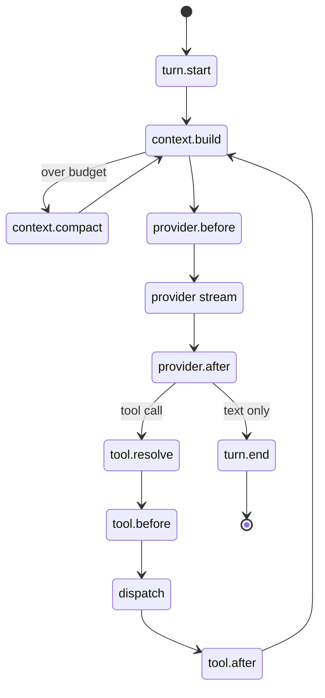

`compact` is a phase of the loop rather than a background job: it fires between passes when the branch stops fitting, and the next pass sees the shorter prefix.

**Can the user override it?** The shape is ours, and deliberately narrow — nothing in the system is a free-running `while`. Every loop, this one included, declares a termination predicate and a hard cap that the kernel enforces rather than trusting to the model (§4.10). The caps, the budgets and what runs at each phase are the user's.

**Routing the next step.** The loop takes one pass at a time; a router decides when it becomes a bounded retry, a sub-agent, five sub-agents or a workflow, and whether the mode should be planning or executing. The rule: **the model proposes, the router disposes** — escalation is a request checked against declared rules and a budget, never something the model does by itself. Rungs are climbed one at a time; skipping one needs an explicit instruction.

| Rung | Justified when | Bounded by |
| --- | --- | --- |
| One pass | default | the turn budget |
| Bounded loop | a verifiable failure signal exists (tests, a gate) | `maxIterations` + predicate |
| Sub-agent | the work needs a fresh context or narrower capabilities | a slice of the parent budget |
| Parallel sub-agents | inputs decompose into demonstrably disjoint sets | the profile's fan-out cap |
| Workflow | the sequence is known ahead of time and deterministic steps can replace model calls | the whole-workflow budget |

**Fan-out is computed, not chosen.** `N = min(disjoint units the parent can name, the profile's fan-out cap, remaining budget ÷ fanout.childCost)`. The per-child cost is a declared profile value, not a model guess and not an after-the-fact estimate; where a profile declares none, the cap and the disjoint units bound N on their own. Independence is demonstrated by giving each child a disjoint input set; overlapping sets mean one problem and one agent.

**A mode is a profile the loop switches into** — `plan` read-only, `execute` the full granted set, `review` never writes — so a switch is a capability change the policy engine answers (§4.8), not a UI state.

**Precedence:** an explicit user instruction, then a declared rule, then a model proposal the router grants, downgrades or denies. Rules read cheap signals only: budget spent, turns in the current mode, read/write mix, diff size, gate and test outcomes, repeated identical calls.

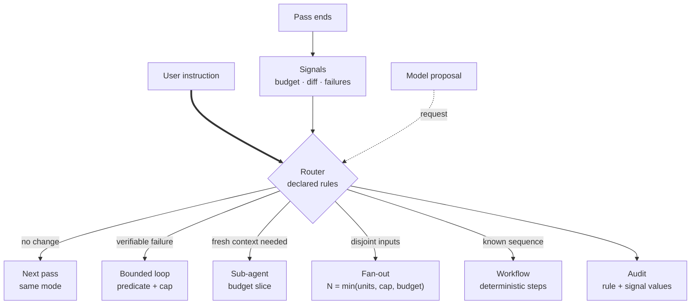

Each decision is audited with the signal values behind it, so "why five and not two" is answerable afterwards (§4.12). Open: whether the router stays declarative — cheap and reproducible, which eval comparison needs — or may itself be a small model call.

**Phases are when; agents are who.** A phase is a point inside a pass where a deterministic verdict fits. An agent is a configuration of the loop — prompt, model, tools, permissions, budget. A **step** is a span running under one agent. So the loop is a sequence of steps, each bound to an agent, and every pass inside a step goes through the same phases whoever is acting.

**The kernel names roles; extensions and profiles bind them.** Every node of the loop that may need intelligence is a named role with a shipped default, resolved through the config layers — the same indirection the provider layer uses, turned on the loop itself.

| Role | Runs at | Default |
| --- | --- | --- |
| `planner` | a step in `plan` mode | ships, read-only tools |
| `executor` | a step in `execute` mode | ships, the granted set |
| `verifier` | the gate of a bounded loop | ships |
| `compactor` | the `compact` phase, summarising a prefix | ships, cheap model |
| `summariser` | a sub-agent's `returns: "summary"`, session titles | ships, cheap model |
| `router` | the escalation decision | unbound — declarative rules |
| `grader` | eval judging (§4.14) | per suite |

**Two ways to define an agent, one shape.** The full form lives in an extension (§4.7): prompt, tools, default model, parameter schema, and optionally its own `run`. The declarative form is written in config and binds to the default runner — prompt, model, tool subset, budget — which is the common case and needs no extension. Either way a binding passes parameters the agent validates at `session.start`, where an unknown or ill-typed key fails with the file and line rather than being ignored mid-turn.

```toml
[agents.planner]                  # bind a role to an agent an extension provides
use    = "myteam.architect"
model  = "claude-sonnet-5"        # overrides the definition's default
params = { maxIterations = 2, depth = 3 }   # checked against its schema

[agents.reviewer]                 # declared here; runs on the default runner
prompt = "Review the diff for correctness and test coverage. Do not edit."
model  = "local/qwen-coder"
tools  = ["git.*", "lsp.*"]       # intersected with the caller's set
budget = { maxTurns = 4, maxTokens = 60000, wallClockMs = 120000 }
```

The dotted form — `agents.planner.model = "claude-sonnet-5"` — is the same table written flat.

Several extensions may each offer a planner; exactly one is bound. An agent declares the `role` it can fill, the config picks which one fills it, and otherwise the closest layer wins (§4.9), with losers named in the ledger. Offering is not binding, and every role is a singleton (§4.7).

Binding a role is one line, and because each binding carries its own model and budget, "plan with a large model, compact with a cheap one" becomes configuration rather than prompt engineering — which is where most of the token saving actually lives.

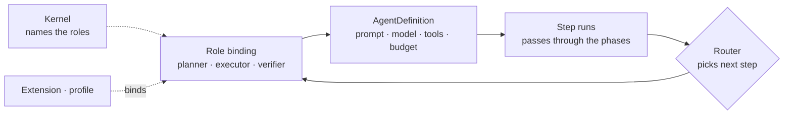

Four invariants keep this from becoming a second control flow. A role binding is intersected with the step's grant and never widens it (§4.10). Exactly one binding wins per role per step, by layer precedence, and the audit records which one ran. Phases fire inside every step regardless of the agent, so an interceptor written once applies to all of them. And a role bound to an agent that does not exist fails at `session.start`, not mid-turn.

That also settles the open question above: a model router is simply the `router` role bound to an agent. Left unbound, routing stays declarative and reproducible, which is what eval comparison needs.

### 4.7 · Extension host

**What it owns.** Process lifecycle for every extension, the RPC bridge, the load ledger.

**What an extension is.** One `ExtensionDefinition` listing what it contributes. The field list is the list of overridable bricks, and that is the whole design rule: **if a subsystem can be replaced, it is a field here; if it is not a field here, it is ours.** §7's fixed-versus-customizable table and this interface are two views of the same decision.

The boundary in one line: **everything the kernel calls is an extension; the kernel is what calls.** Every replaceable brick is a leaf the kernel invokes and whose result it validates, or is constrained to narrowing only. The loop is not among them — budgets are enforced by owning the pass, the phase contract needs one thing running the phases, and "every decision is audited" only holds if no decision happens outside. A genuinely different architecture embeds the kernel as a library (§5.1); it does not replace the loop.

```ts
interface ExtensionDefinition {
  api: "orrery-ext/1";                 // contract version; a major it does not know is refused at load
  id: string;                          // namespace for everything below
  runtime: "wasm" | "node" | "python" | "process";
  requires?: Capability[];

  // Collections — many extensions contribute, all are merged.
  tools?: ToolDef[];
  mcp?: McpServerDef[];
  skills?: SkillDef[];
  agents?: AgentDefinition[];          // offered; the config binds one per role
  workflows?: WorkflowDef[];           // §4.10 — declared sequences, same as agents
  interceptors?: Interceptor[];        // §4.1 — typed verdicts, no I/O
  lifecycle?: LifecycleHandler[];      // §4.3 — I/O at scope boundaries
  providers?: Provider[];              // §4.5 — model I/O + ProviderAuth
  graders?: GraderDef[];               // §4.14
  commands?: CommandDef[];
  views?: ViewBinding[];
  renderers?: RendererDef[];           // §6.3 — custom surface kinds, per client, gated by `render`               // §6.7 — projects loop events onto surfaces

  // Singletons — at most one active; conflicts resolve by layer precedence.
  memory?: MemoryProvider;             // §4.3
  session?: SessionStore;              // §4.2 — storage backend only
  permissions?: PermissionHandler;     // §4.8 — may narrow, never widen
  router?: RouterRules;                // §4.6 — next-step routing
}

// An agent is written here, in code. Configuration binds and parameterises it,
// it never defines one (§4.6). This supersedes SubagentDef in §4.10.
interface AgentDefinition<P = unknown> {
  name: string;                     // "myteam.architect"
  role: Role;                       // "planner" | "executor" | "verifier" | …
  systemPrompt: string | ((p: P) => string);
  model?: string;                   // default; a binding may override it
  tools?: string[];                 // subset of the caller's visible set
  permissions?: Partial<Grant>;     // intersected with the caller, never widened
  budget: Budget;                   // mandatory: an agent that cannot terminate is an incident
  isolation: "context" | "process"; // fresh context, or its own host too
  params?: ParamSchema<P>;          // declared here, validated at session.start
  returns?: "summary" | "structured" | "transcript";
  // Optional: own control flow. Omitted, the standard loop runs the agent.
  run?(input: AgentInput, params: P, ctx: AgentCtx): Promise<AgentResult>;
}
```

`AgentDefinition` is the single shape for every agent in the system, sub-agents included — it carries over `isolation` and the mandatory `budget` that §4.10 required of `SubagentDef`, and adds the role, the parameter schema and an optional `run`. So the router in §4.6 can send a planning step to one agent with its own system prompt and model and an execution step to another. An agent is a configuration of the loop, never a second loop.

Collections merge across extensions; singletons do not, so two extensions claiming `router` resolve by layer precedence and the loser is named in the ledger. Three singletons carry hard conditions: a `PermissionHandler` may only narrow, never turn a deny into an allow, and never reach the managed layer (§4.9); a `SessionStore` is a storage backend, not a change of semantics — turn tree, per-turn durability and replay still hold; a `MemoryProvider` obeys §4.3's scopes and visibility rule whatever it stores.

**Failure after load is as defined as failure during it.** A collection member — tool, interceptor, grader — fails its call and is disabled for the session, recorded `degraded`. A singleton falls back to the shipped default with a warning, except two: a `PermissionHandler` that panics fails **closed** and its call is denied, and a `SessionStore` failure ends the session, because history is the one thing that cannot be reconstructed.

**Testing an extension needs no model.** `orrery ext test` loads a definition against a mock broker: grants declared in the test, tool calls returning recorded results, surfaces asserted as data. The author sees the same ledger and the same denials a real session would produce.

```ts
interface ExtensionHost {
  load(def: ExtensionDefinition, grant: Grant): Promise<LoadOutcome>;
  call(ext: string, tool: string, input: unknown, ctx: CallCtx): Promise<ToolResult>;
  unload(ext: string): Promise<void>;         // live, no session restart
  ledger(): LoadLedger;
}

type LoadOutcome =
  | { status: "loaded"; contributes: Contribution[]; ms: number }
  | { status: "degraded"; contributes: Contribution[]; disabled: string[]; reason: string }
  | { status: "failed"; reason: string; stage: "resolve" | "manifest" | "init" }
  | { status: "skipped"; reason: "policy" | "disabled" | "unsigned" };
```

`LoadOutcome` is queryable over RPC, rendered by any client, and written to the audit stream at session start.

**Integrating your own library** — say an internal Java build-graph analyser. Five steps.

**1. Declare.** The manifest is the contract — nothing outside it is available at runtime.

```toml
[extension]
api     = "orrery-ext/1"
name    = "buildgraph"
version = "1.2.0"
runtime = "node"                     # wasm | node | python | process

[provides]
tools = ["impacted", "deps"]         # → buildgraph.impacted, buildgraph.deps

[requires]
read  = ["$WORKSPACE/**"]
spawn = ["java"]
net   = false
```

**2. Implement.** The extension gets a context object. It cannot import `fs` or `child_process` — those are stripped from the isolate; the equivalents arrive through `ctx`, and every one goes back through the broker.

```ts
export default defineExtension({
  tools: {
    impacted: {
      description: "Modules impacted by the current diff",
      input: z.object({ since: z.string().default("HEAD~1") }),
      async run({ since }, ctx) {
        // Brokered: policy-checked, budgeted, audited, cancellable.
        const out = await ctx.proc.run("java", ["-jar", "bg.jar", "--since", since], {
          timeoutMs: 30_000,
        });
        return ctx.ui.table({
          columns: ["module", "reason"],
          rows: parse(out.stdout),
        });
      },
    },
  },
});
```

`ctx.ui.table` describes a table rather than drawing one: the TUI renders a React component, a web client a DOM table, from the same payload.

**3. Grant.** Installing surfaces the manifest's requests as a diff the user or admin approves:

```
 buildgraph 1.2.0 requests:
   read     $WORKSPACE/**        [allow] [allow once] [deny]
   spawn    java                 [allow] [allow once] [deny]
```

Denying `spawn` does not fail the install. `buildgraph.impacted` is disabled, anything else it provides keeps working, and the ledger records `degraded`.

**4. Scope.** Where it applies is configuration, not code — enabled globally, per workspace, or per project, and optionally restricted to named sub-agents.

**5. Distribute.** Publish to npm for the community, or to the organisation's signed registry for internal use. An enterprise pins the version and the signature; the harness refuses to load anything unpinned when managed config says so.

**Any language takes the same five steps.** A Rust, Go or Python extension changes only the `runtime` line and the binding style — same manifest, same grant flow, same registry, same namespacing. The kernel does not know which runtime it dispatched to, which is what keeps the community path and the performance path from splitting the ecosystem in two. The three runtime paths are set out below.

### 4.8 · Policy engine and resource broker

**What they own.** Every decision about whether a call may run, and every handle that would let it.

```ts
type Aspect =
  | "tool" | "mcp" | "skill" | "ext" | "mode"
  | "read" | "write" | "spawn" | "net" | "creds" | "ui" | "render"
  | "mem.read" | "mem.write";   // scoped by MemScope, not by path (§4.3)

type Subject = "agent" | `ext:${string}` | `agent:${string}`;

interface Rule {
  id: RuleId;
  aspect: Aspect;
  selector: string;       // "shell.exec: npm run *", "./src/**", "domain: *.corp"
  layer: Layer;           // managed | org | user | workspace | project
  source: string;         // file and line, for `permissions explain`
}

interface RuleSet {       // one per subject; deny, then ask, then allow
  subject: Subject;
  deny: Rule[]; ask: Rule[]; allow: Rule[];
}

interface Capability {
  aspect: Aspect;
  scope: string[];        // globs, binary names, hosts, secret refs
}

interface PolicyEngine {
  check(call: PendingCall, subject: Subject, scope: AgentScope): Decision;
  consent(d: Decision, answer: ConsentAnswer): Decision;    // user said yes/no
  explain(call: PendingCall, subject: Subject): Explanation; // rule, layer, file, verdict
}

type Decision =
  | { verdict: "allow"; token: CapabilityToken; rule: RuleId }  // single-use, this call only
  | { verdict: "ask"; prompt: ConsentPrompt; rule: RuleId; fallback: "deny" }
  | { verdict: "deny"; rule: RuleId; reason: string };

// Contributed by an extension (§4.7). It may narrow a decision, never widen one:
// allow → ask | deny, ask → deny. A wider verdict is dropped and logged.
interface PermissionHandler {
  id: string;
  review(call: PendingCall, subject: Subject, proposed: Decision): Promise<Decision>;
}
```

The `CapabilityToken` is the mechanism. The broker accepts no call without one, tokens are minted per call and expire with it, and no extension ever holds a file descriptor, socket or secret value — credentials are passed as references the broker resolves at the point of use.

**Where credentials live.** One store per install, addressed by name — the OS keychain where there is one, a `0600` file where there is not. `ProviderAuth.login` hands the broker a token to keep; a `creds` grant resolves a name at the point of use and never returns the value. Rotation rewrites the name, and nothing holding a reference changes.

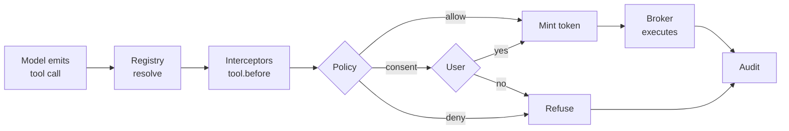

**Sub-agent inheritance.** A sub-agent's grant is the intersection of its parent's grant and its own declaration — never wider. A sub-agent that cannot prompt fails the call with a typed error the parent handles, rather than auto-denying into a stall.

**A denial is terminal and says so.** A refused call returns a typed `denied` result rather than an error, so the model knows the same call will not succeed and re-plans instead of retrying it until the budget is gone. A repeated denied call is a routing signal (§4.6), not a retry allowance.

**The five rule kinds an enterprise configures:**

| Rule kind | Example | Overridable by user |
| --- | --- | --- |
| Managed deny | `net` to anything but the internal proxy | No |
| Managed allow | `read` on the workspace | No |
| Default deny | `spawn` outside the allowlist | With consent |
| Default allow | `ui` surfaces | Yes |
| Unpinned extension | anything not in the signed registry | No, when managed config says so |

**Rules are patterns, not just kinds.** A capability's `aspect` says what a call is; it does not say which instance is acceptable. [Claude Code's permission rules](https://code.claude.com/docs/en/permissions) are the ergonomics to borrow: `Tool` or `Tool(specifier)`, three lists — `deny`, `ask`, `allow` — evaluated in that order, first match wins, specificity deliberately irrelevant, and an allow can never carve an exception out of a deny. We keep that and add what a multi-principal system needs.

| Aspect | Example rule | What the selector matches |
| --- | --- | --- |
| `tool` | `tool(ripgrep.search)`, `tool(shell.exec: npm run *)` | namespaced id, then the tool's own specifier |
| `mcp` | `mcp(github.*)`, `mcp(github.get_*)` | server, then tool name |
| `skill` | `skill(review-*)` | skill name |
| `ext` | `ext(buildgraph)` | extension id, checked at load |
| `mode` | `mode(plan)`, `mode(execute)` | which mode the subject may enter |
| `read` `write` `spawn` `net` `creds` | `write(./src/**)`, `net(domain: *.corp.internal)` | broker resources — paths gitignore-style, domains, command text |

The operator set stays small on purpose: `*` for any text, `**` for any depth in a path, a trailing `prefix:*`, and `param:value` to match one named input. A `re:` escape hatch exists for real regular expressions but is off by default and warned about at load — a permission rule nobody can read at a glance is a governance problem rather than a feature.

Paths resolve before they match — symlinks, `..`, and case-folding where the filesystem is case-insensitive — or a link out of the workspace defeats the rule. On Windows, UNC and drive-relative forms normalise first, and `spawn` matches the resolved executable rather than the typed name.

One vocabulary note, because both words appear throughout: **`ask` is the verdict, consent is the interaction.** A rule in the `ask` list produces `verdict: "ask"`, which the kernel turns into a `consent.request` frame (§5.2) carrying a deadline; the answer comes back as `consent.answer`, and a profile with `consent = "never"` resolves every `ask` to its fallback without a prompt.

**Rules are written per subject**, which is the part a single-principal harness has no equivalent for. Here the agent, each extension and each sub-agent are separate principals with separate rule sets.

```toml
[permissions]                       # the agent itself
allow = ["tool(git.*)", "read(./**)"]
ask   = ["write(./**)"]
deny  = ["net(domain: *)"]

[permissions."ext:buildgraph"]      # one extension
allow = ["spawn(bazel *)", "read(./**)"]
deny  = ["creds(*)"]

[permissions."agent:critic"]        # one sub-agent
allow = ["tool(lsp.*)"]
```

A subject's effective set is its own rules intersected with its parent's (§4.10): a rule file narrows a sub-agent, it never widens one. Across config layers, deny is a union and the managed layer's deny cannot be relaxed (§4.9); allow and ask resolve by layer precedence.

**Modes are permissions, not a UI state.** Because `mode(plan)` and `mode(execute)` are grantable like anything else, "this profile may never enter execute" is one line, and the router's mode switch in §4.6 is an ordinary capability request the policy engine answers.

**Say plainly which layer enforces.** Claude Code's docs are candid that a `Bash(curl *)` deny stops `curl https://x` but not `/usr/bin/curl https://x` or `sh -c 'curl https://x'`. Patterns describe intent; they do not enforce. So: **rules decide whether to ask, the broker and the token decide what can be touched.** A `spawn` grant is enforced where the process is created, not by the string that matched — which is what lets the pattern layer be ergonomic without being load-bearing.

**Explainability is the point of the whole thing.** `orrery permissions explain <call>` dry-runs a call and prints the rule that matched, the layer and file it came from, and the verdict — the same provenance `orrery config explain` gives. Each minted token records the rule that produced it, so the audit answers "which rule allowed this" rather than "it was allowed".

**Audit.** One append-only structured stream: extension loads, capability decisions with the rule that produced them, tool calls with input hashes, model requests with token counts, consent answers, sub-agent spawns, routing decisions with their signal values. Exportable to a SIEM.

Redaction is in the schema, not the deployment. Tool inputs are hashed. Credential values never appear — the broker resolves references at the point of use, so there is nothing to log. Memory entries, surface payloads and prompt bodies are recorded by reference (id, scope, length, hash), with content retrievable only from the session store.

### 4.9 · Configuration

**What it owns.** Resolving five layers into one effective config, and proving where every value came from.

| Layer | Location | Who writes it | Overridable |
| --- | --- | --- | --- |
| Managed | OS-managed path | IT / security | No |
| Organisation | Signed, fetched from registry | Platform team | Only where marked |
| User | `~/.orrery/config.toml` | The developer | Yes |
| Workspace | `.orrery/config.toml` | The team, committed | Yes |
| Project | Nested `.orrery/`, closest wins | The developer | Yes |

**Trust gating.** Project-local config, extensions and interceptors do not load until the project is trusted — cloning a repository must not be equivalent to running its code. Codex does the same.

**Startup order, because trust and discovery depend on each other.** The sequence is fixed and one-directional, so nothing that a project could supply gets a vote on whether the project is trusted.

1. Read the managed, organisation and user layers. These need no trust decision — the developer or the administrator wrote them.
2. Resolve trust for the workspace from those layers alone, plus the stored answer for this path. An untrusted workspace stops here and the session runs with user-level config only.
3. Discover — one pass over extensions, skills, prompts and MCP servers across the layers now in force (§4.11).
4. Load and validate: agent parameter schemas, role bindings, singleton conflicts. A missing binding or an unknown parameter fails here, naming the file and line.
5. Fire `session.start` — interceptors first for verdicts on the resolved manifest, then lifecycle handlers for their I/O.

An extension therefore cannot influence the trust decision that governs whether it loads, which is the point. The manifest the session ends up with is what the load ledger reports and what the audit stream records.

**Profiles are how "configure your own harness" becomes concrete.** A profile is a named composition of everything the runtime assembles:

```toml
[profile.review]
model = "claude-sonnet-5"
extensions = ["git", "lsp", "buildgraph"]
interceptors = ["no-write-outside-diff"]
subagents = ["critic"]
skills = ["review-checklist"]
permissions = { write = false }              # review never writes

[profile.ci]
model = "local/qwen-coder"
extensions = ["git", "test-runner"]
consent = "never"                            # no human present; deny instead of prompt
audit = { sink = "otlp://collector.internal" }
```

**Provenance and first run.** `orrery config explain <key>` prints the resolved value and the layer that set it. `orrery init` writes a workspace config from a chosen profile; `orrery import` reads an existing Claude Code or Codex setup — permissions, MCP servers, skills — into the equivalent layers, since we already parse both formats.

### 4.10 · Orchestrator — sub-agents, workflows, loops

**What it owns.** Running bounded agent runs and driving deterministic sequences around them — the running, not the content. Agents and workflows are contributed by extensions or declared in config (§4.7); the orchestrator ships none of its own.

**Sub-agent.** A branch of the session tree with its own scope, its own budget, and a grant that is at most its parent's. There is no separate sub-agent type: a sub-agent is an `AgentDefinition` (§4.7) that the orchestrator runs on a branch, which is why the same declaration serves a role binding in §4.6 and a workflow step below.

Two fields carry the weight. `budget` is mandatory — an agent that cannot terminate is a cost incident, so the kernel enforces `maxTurns`, `maxTokens` and `wallClockMs` rather than trusting the prompt. `returns` is typed, so a structured return gives the parent data rather than prose to re-parse.

**Workflow.** A declared sequence with deterministic steps between model calls — where cost comes out, since the deterministic steps cost nothing. Workflows arrive the same way agents do: `workflows?` on an `ExtensionDefinition`, or declared in config. The kernel evaluates the steps and enforces the budget; it supplies neither.

```ts
type Step =
  | { kind: "agent"; subagent: string; input: Expr }
  | { kind: "tool"; ref: string; input: Expr }        // no model call at all
  | { kind: "parallel"; steps: Step[]; join: "all" | "first" | "quorum" }
  | { kind: "loop"; body: Step[]; until: Predicate; maxIterations: number }
  | { kind: "gate"; check: Predicate; onFail: "stop" | "retry" | "escalate" };

interface Workflow {
  name: string;
  trigger: "command" | "event" | "manual";
  steps: Step[];
  budget: Budget;           // whole-workflow ceiling, enforced by the kernel
}
```

**Loops.** The rule is §4.6's and holds everywhere: no free-running `while`, every loop declares a predicate and a hard cap, both kernel-enforced. What this section adds is the declared form — a `loop` step in a workflow. The state machine below is that shape.

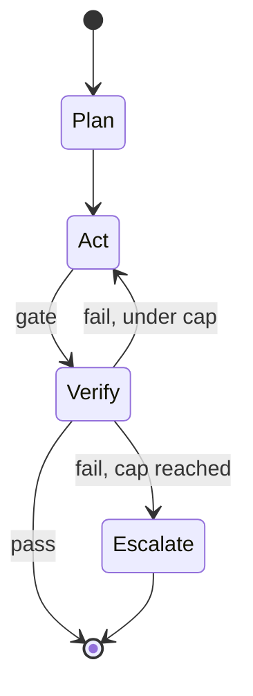

**Bounded delegation, not fan-out.** Parallel steps are for independent work with a join condition, not for racing five agents at one problem.

### 4.11 · Skills and MCP

Two extension mechanisms that already have industry-standard shapes. Adopt both as specified; add only the governance layer.

**Skills.** Adopt the `SKILL.md` format unchanged — the agentskills.io spec already works across Pi, Claude Code, Cursor and Codex.

```ts
interface SkillRef {
  name: string;
  source: "builtin" | "user" | "workspace" | "extension" | "registry";
  path: string;
  // Additions over the bare spec:
  scope: AgentScope[];              // which agents may load it
  grant?: Partial<Grant>;           // scripts/ runs under this, not the user's shell
}
```

The one addition: a skill's bundled `scripts/` run under a capability grant. Elsewhere they run with the user's full privileges, which makes a skill a better attack vector than an extension because it looks like documentation.

**MCP.** Client and server, both brokered.

```ts
interface McpBroker {
  connect(server: McpServerSpec, grant: Grant): Promise<McpSession>;
  // Tools land in the registry namespaced: mcp.<server>.<tool>
  register(session: McpSession): ToolRef[];
  expose(scope: AgentScope): McpServerHandle;   // Orrery as an MCP server
}
```

Three decisions:

1. **Namespaced like everything else.** A server registers as an extension id `mcp.<server>`, so its tools are ordinary `ToolRef`s — `mcp.jira` + `create_issue` — with no second namespacing scheme (§4.4). A server whose tool collides with an extension's is a resolution event, not a failure.
2. **Behind the same policy.** An MCP server is remote code with network access; it gets a grant, its calls are audited, and managed config can pin the allowlist — matching what Codex already does with MCP server allowlists in managed requirements.
3. **Connection lifecycle is the core's.** Discovery and connection are different things: a server is *discovered* at session start, always, and *connected* when first needed. Servers are health-checked, and a dead one degrades its tools rather than stalling turns. A `list_changed` notification does not silently extend the session — the new tools are re-resolved against policy and either admitted and recorded in the ledger or refused, because a tool set that grows after the manifest was approved is exactly what the manifest exists to prevent.

**Discovery.** One pass at session start resolves skills, prompts, MCP servers and extensions across the layers then in force (§4.9, step 3), producing the manifest the load ledger reports. If it is in the model's visible set, it is in the manifest. Connecting to a discovered server may happen later; discovering one may not.

### 4.12 · Observability

**Observability.** Three streams, all structured, all exportable:

| Stream | Contents | Consumer |
| --- | --- | --- |
| Load ledger | Per-extension outcome, reason, duration | Developer debugging, session-start audit |
| Audit | Capability decisions, tool calls, spawns, consent | Security, SIEM |
| Telemetry | Tokens per turn, cache hits, tool latency, compaction, cost per role binding | Cost analysis, the efficiency claim |

### 4.13 · Polyglot extensions

The kernel is Rust. An extension can be written in any language, and the team picks based on what they are already good at — not on what the harness author chose.

| Path | Languages | Startup | Distribution | Best for |
| --- | --- | --- | --- | --- |
| **WASM component** | Rust, Go, C/C++, Zig, C#, TinyGo | \~ms | Single `.wasm` artefact | Hot paths, parsers, indexers, sandboxed by construction |
| **Managed host** | TypeScript / JavaScript, Python | \~tens of ms | npm, PyPI | Ecosystem reach, glue, rapid iteration |
| **External process** | Anything that speaks the protocol — Java, C#, Ruby, Elixir, a legacy binary | Process spawn | Any, including a container image | Wrapping an existing internal service or toolchain |

**One manifest across all three.** Only `runtime` changes; `provides`, `requires`, namespacing, grants, the registry and the ledger are identical.

```toml
[extension]
name = "buildgraph"
runtime = "wasm"        # "wasm" | "node" | "python" | "process"

# runtime = "process" only:
[process]
command = "./bin/buildgraph-server"   # or an OCI image reference
protocol = "orrery-ext/1"             # JSON-RPC over stdio
```

**The same extension in Go, as a WASM component:**

```go
//go:generate wit-bindgen tiny-go ../wit --out-dir=gen

func Impacted(in ImpactedInput, ctx Ctx) (Surface, error) {
    // ctx.Proc / ctx.Fs are brokered exactly as in the TypeScript path —
    // no os/exec, no os.Open. Capability tokens, budgets and audit apply identically.
    out, err := ctx.Proc.Run("java", []string{"-jar", "bg.jar"}, RunOpts{TimeoutMs: 30000})
    if err != nil { return Surface{}, err }
    return Table([]string{"module", "reason"}, parse(out.Stdout)), nil
}
```

**The WIT interface is the single source of truth.** One `.wit` definition generates bindings for every WASM-target language and is the schema the JSON-RPC paths serialise. Adding a language means generating bindings, not changing the kernel — which is what keeps this from becoming six half-maintained SDKs.

```wit
world orrery-extension {
  import broker: interface { run-proc: func(cmd: string, args: list<string>, opts: run-opts) -> result<proc-out, error> }
  export tools: interface { call: func(name: string, input: json) -> result<surface, error> }
}
```

**Costs, stated honestly:**

- The WASM path constrains what a language can do — threads, some syscalls and large native dependencies are limited, and not every ecosystem has mature WASM targets.
- The external-process path has no sandbox of its own beyond what the broker withholds, so an enterprise will want those pinned by image digest.
- Three paths is three sets of docs and examples. Ship WASM and Node first-class from phase 2; add Python and the process protocol once the contract has stopped moving.

### 4.14 · Benchmarks and evaluation

Running a benchmark is a core capability, not an extension.

**Why in the core.** A reproducible run needs what only the kernel has: deterministic session construction, a pinned profile, budget enforcement, real token counts at the provider boundary, and an audit trail. An extension can add a suite; it cannot make a run reproducible.

**Pluggability threatens reproducibility, so a run pins it.** A memory provider reading a mutable `global` store and a `router` bound to a model both make the same case behave differently on two days. An `EvalRun` declares both; `memory: "off"` and `router: "declared"` are the defaults.

The same runner keeps the singleton contracts honest: a conformance suite feeds a `SessionStore` branch, compact and replay cases, checks a `MemoryProvider` against the scope lifetimes, and offers a `PermissionHandler` decisions it must not widen.

**The runner.**

```ts
interface EvalCase {
  id: string;
  workspace: WorkspaceSpec;        // repo + commit, or a fixture archive
  prompt: string;
  grade: Grader;                   // see below
  budget: Budget;
}

interface EvalRun {
  suite: string;
  matrix: { profile: string[]; model: string[]; seed?: number[] };
  concurrency: number;
  isolation: "worktree" | "container";   // cases never share state
  memory: "off" | { provider: string; scopes: MemScope[] };  // off by default
  router: "declared" | { agent: string };                    // declared by default
}

interface EvalResult {
  case: string; profile: string; model: string;
  outcome: "pass" | "fail" | "error" | "budget-exceeded";
  score?: number;
  cost: { inputTokens: number; outputTokens: number; cacheHits: number; usd?: number };
  byRole: Record<Role, { tokens: number; calls: number; usd?: number }>;  // §4.6 bindings
  timing: { wallMs: number; modelMs: number; toolMs: number };
  turns: number; toolCalls: number;
  transcript: SessionRef;          // full replayable session
}
```

**Graders are pluggable, and three kinds cover most needs:**

| Grader | How it scores | Use for |
| --- | --- | --- |
| `command` | Exit code of a script (tests, build, lint) | SWE-style patch benchmarks |
| `assertion` | Declared checks on files, diffs, tool calls | Behavioural and safety checks |
| `model` | A judge model with a rubric | Open-ended quality, with its own cost counted |

**Suites are just packages.** Public suites (SWE-bench-style harness evaluations, internal regression sets) install from the registry like any extension, declare their fixtures, and run under the same permission grants. A team's private suite over their own monorepo is the common case and needs no special treatment.

```bash
orrery eval run swebench-lite --profile review,fast --model claude-sonnet-5,local/qwen
orrery eval compare run-812 run-819        # two runs, same suite
orrery eval replay run-812 --case api-42   # open the exact session that failed
```

**Cross-harness comparison.** The runner takes an adapter, so Claude Code, Codex or Pi can be driven as an external agent under the same cases, budgets and graders — each has a non-interactive JSON mode that makes this tractable.

```toml
[adapter.codex]
command = "codex exec --json"
parse = "jsonl"

[adapter.claude-code]
command = "claude --print --output-format json"
```

**Where the numbers come from.** Cost and timing are read from the kernel's telemetry at the provider boundary, never estimated afterwards.

**CI shape.** `orrery eval run --profile ci --format junit` exits non-zero on regression against a baseline.

### 4.15 · Shared types

The types the sections above pass between them. Nothing here is new — it is what those interfaces already assume, written down once so they agree.

```ts
type Role  = "planner" | "executor" | "verifier" | "compactor"
           | "summariser" | "router" | "grader";
type Layer = "managed" | "org" | "user" | "workspace" | "project";
// Names resolve closest-layer-first; a managed deny is final. Opposite directions,
// on purpose (§4.4, §4.8).

// What a subject may do. Intersection is the only operation ever applied to a Grant:
// a child's is never a superset of its parent's (§4.10).
interface Grant {
  capabilities: Capability[];        // { aspect, scope } — §4.8
  consent: "always" | "once" | "never";
}

// Every bounded run declares one. The kernel enforces it; none of it is advisory.
interface Budget {
  maxTurns: number;
  maxTokens: number;
  wallClockMs: number;
  maxUsd?: number;
}

// What may be seen and called at a given point.
interface AgentScope {
  agent: string;
  branch: BranchId;
  tools: string[];                   // the visible set, not a suggestion
  grant: Grant;
}

// Workflow expressions are deliberately not a language: a step input is a literal or
// a reference to an earlier step's typed return, and a predicate compares declared
// values. Neither can call out, which is what keeps a workflow's cost predictable.
type Expr = Literal | { ref: string; path?: string[] };
type Predicate =
  | { lhs: Expr; op: "eq" | "ne" | "lt" | "gt" | "contains"; rhs: Expr }
  | { all: Predicate[] } | { any: Predicate[] } | { not: Predicate };

type ParamSchema<P> = JsonSchema;    // validated at session.start (§4.6)
type Contribution   = { kind: keyof ExtensionDefinition; name: string };
interface Usage      { inputTokens: number; outputTokens: number; cacheHits: number; usd?: number }
interface SessionRef { session: SessionId; branch: BranchId; turn?: TurnId }
// SessionId, TurnId, BranchId, CallId, RuleId, SurfaceId and Seq are opaque ids.
```

## 5 · Client/server protocol

One protocol serves every client: the TUI, the CLI, CI, the ADE later. There is no privileged client — the reference TUI speaks exactly what a third party would.

### 5.1 · Transport

The kernel is a server whether or not it looks like one. Same frames over three transports.

| Transport | Used by | Notes |
| --- | --- | --- |
| In-process | `orrery` CLI, single-shot runs | No serialisation; same trait objects |
| Unix socket / named pipe | TUI attaching to a running kernel | Default for interactive use |
| TCP + TLS | Remote execution host | Same frames, authenticated |

Framing is length-prefixed JSON (or CBOR when the client asks). The key decision: **the kernel is always a server, even in-process.** A CLI that skips serialisation still goes through the same request/event types, so there is no second code path that drifts.

### 5.2 · Frames

```ts
// Client → kernel. Every request carries an id; replies and events reference it.
type Request =
  | { t: "session.create"; profile: string; workspace: string }
  | { t: "session.attach"; session: SessionId; since?: Seq }
  | { t: "turn.submit"; session: SessionId; input: UserInput }
  | { t: "turn.cancel"; session: SessionId; turn: TurnId }
  | { t: "intent"; session: SessionId; surface: SurfaceId; value: unknown }
  | { t: "consent.answer"; prompt: PromptId; answer: "allow" | "once" | "deny" }
  | { t: "command"; session: SessionId; name: string; args?: unknown }
  | { t: "query"; of: "ledger" | "telemetry" | "config" | "tools" };

// Kernel → client. Ordered per session, each tagged with a monotonic seq.
type Event =
  | { t: "turn.started"; seq: Seq; turn: TurnId }
  | { t: "delta"; seq: Seq; surface: SurfaceId; patch: SurfacePatch }
  | { t: "tool.started"; seq: Seq; call: CallId; ref: ToolRef }
  | { t: "tool.settled"; seq: Seq; call: CallId; outcome: Outcome }
  | { t: "consent.request"; seq: Seq; prompt: ConsentPrompt; deadlineMs: number }
  | { t: "turn.settled"; seq: Seq; turn: TurnId; usage: Usage }
  | { t: "error"; seq: Seq; scope: "turn" | "session"; detail: ErrorDetail };
```

### 5.3 · Session lifecycle

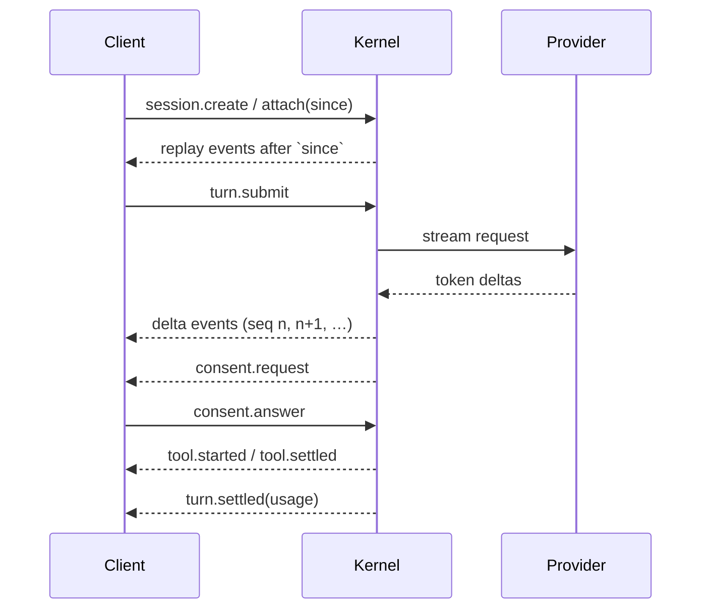

Sessions outlive clients. The kernel keeps running when the terminal closes; reattaching replays from the last `seq` the client saw. That single property is what makes remote execution and session handoff possible later without protocol changes.

### 5.4 · Streaming, backpressure, cancellation

| Concern | Rule |
| --- | --- |
| Ordering | Per-session monotonic `seq`; clients detect gaps and re-attach |
| Slow client | Kernel coalesces text deltas rather than buffering unboundedly; the turn never blocks on rendering |
| Cancellation | `turn.cancel` propagates one `AbortSignal` through provider stream, tool calls and sub-agents |
| Consent timeout | Every prompt carries a deadline; expiry resolves to the declared fallback (normally deny) |
| Headless | `consent: "never"` profiles deny instead of prompting, so CI cannot hang |

The rule that keeps this simple: rendering never applies backpressure to the agent loop. A stalled client degrades its own view, not the run. Coalescing and replay do not conflict, because they read from different places — what a slow client loses is intermediate *frames*, while re-attachment replays from the session store, which has every settled turn in full. The kernel buffers frames only for as long as a connected client is behind.

**Cancellation stops work; it does not undo it.** A tool declaring `atomic: true` is reverted by the broker — write to a temporary file and rename is the usual shape. Everything else reports what it completed in the `tool.settled` outcome, so the next pass sees the partial state instead of guessing at it. A cancelled child is killed with its process group, never orphaned.

### 5.5 · Non-interactive modes

`orrery run -p "…"` prints final text. `orrery run --json` emits the same `Event` frames as line-delimited JSON on stdout. CI, the eval runner and the cross-harness adapters all consume that one stream — no separate reporting path to maintain.

### 5.6 · Adopting AG-UI

**The name is a homonym today, and that should stop.** This document has used "AGUI" for a protocol of our own, but [AG-UI](https://docs.ag-ui.com) is a published Agent-User Interaction protocol with SDKs, framework integrations and client libraries. Either we adopt it or we rename ours. Adopting is the better trade, because what it standardises is precisely what we were about to reinvent.

**What it specifies.** A typed event stream from agent to client, transport-agnostic — HTTP SSE, a binary HTTP variant, WebSockets, webhooks — with user input arriving as a `RunAgentInput` on the run call. The catalogue covers run lifecycle, steps, streaming text, tool calls, state (`StateSnapshot` and `StateDelta` as RFC 6902 JSON Patch), activity, reasoning, sub-agents, and two escape hatches, `Raw` and `Custom`.

**What it deliberately does not specify: a rendering vocabulary.** AG-UI carries events and state; what a component looks like is the application's business. That is the gap §6.2 fills, which makes the two complementary rather than competing — **AG-UI is our wire, `Surface` is our payload.**

| §5.2 frame | AG-UI event |
| --- | --- |
| `turn.started` · `turn.settled` · `error` | `RunStarted` · `RunFinished` · `RunError` |
| `delta` carrying text | `TextMessageStart` · `Content` · `End` |
| `tool.started` · `tool.settled` | `ToolCallStart` · `Args` · `ToolCallResult` · `End` |
| `delta` carrying a `SurfacePatch` | `StateDelta` — our patch ops are already JSON Patch in shape |
| step boundary, mode change (§4.6) | `StepStarted` · `StepFinished`, `ActivitySnapshot` |
| sub-agent spawn and return (§4.10) | `SubagentStarted` · `Finished` · `Error` |
| `consent.request` · `consent.answer` | no equivalent — `Custom`, plus our control RPC |

**Three things stay ours.** The control RPC, because AG-UI's input path is a run invocation rather than a session protocol — `session.attach(since)`, `turn.cancel`, `intent` and `query` have no counterpart. The `seq` and replay guarantee, because AG-UI has no resumption story. And consent, carried as `Custom`: a prompt with a deadline and a declared fallback is more than an interrupt.

**One tension to name rather than paper over.** AG-UI's shared state is bidirectional by design; §3's invariant is that clients send intents and never state mutations. We keep the invariant — `StateSnapshot` and `StateDelta` flow outward only, and a client edit arrives as an `intent` the kernel validates. That is a restriction of AG-UI rather than a violation of it, and anyone porting a component that expects to write state directly needs to know.

**What adoption buys.** Existing AG-UI clients and component libraries work against this kernel unmodified, the cross-harness adapters in §4.14 gain a common event shape, and a third-party TUI or web client builds against a published spec instead of ours.

## 6 · UI management

Extensions never draw. They emit a surface tree; the attached client renders it in its own idiom. One extension ecosystem, every surface.

### 6.1 · The pipeline

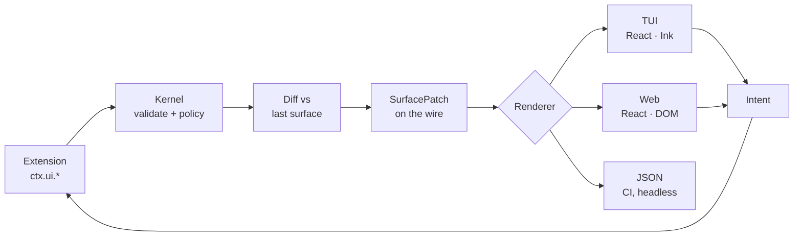

The kernel diffs, not the client. An extension re-emits its whole surface; the kernel sends only what changed. That keeps extension code trivial and the wire small.

**Surfaces seal at `turn.settled`.** Diffing needs a live surface, and §6.4's hybrid TUI moves finished turns into native scrollback where nothing can be patched any more. So a surface belonging to a settled turn is closed: a patch arriving for one is refused at the kernel and reported to the extension, not sent to a client that cannot apply it. An extension with something to add after its turn ends emits a new surface in the current turn.

### 6.2 · Surface vocabulary

**Two tiers.** The core surfaces are a standard library: typed, shipped, and implemented by every renderer — which is what makes them usable as a fallback. Most extensions need nothing else.

```ts
// Core surfaces — the standard library. Every renderer implements every one.
type Surface = { id?: SurfaceId; status?: Status } & (
  | { t: "text"; value: string; style?: "plain" | "code" | "muted" }
  | { t: "table"; columns: string[]; rows: Cell[][] }
  | { t: "tree"; nodes: TreeNode[] }
  | { t: "diff"; path: string; hunks: Hunk[] }
  | { t: "progress"; label: string; done?: number; total?: number }
  | { t: "stream"; id: string }                     // appendable log
  | { t: "task"; items: TaskItem[] }                // plan steps, per-item state
  | { t: "question"; prompt: string; choices: Choice[];
      multi?: boolean; free?: boolean;              // several answers; free text too
      default?: string; deadlineMs?: number }       // how it resolves unattended
  | { t: "form"; fields: Field[]; submit: string }
  | { t: "stack"; dir: "row" | "col"; title?: string; collapsed?: boolean;
      children: Surface[] }
  | { t: "markdown"; value: string; complete: boolean }
  // Anything the library cannot express — with a mandatory core-only fallback.
  | { t: "custom"; kind: string;                    // namespaced: "buildgraph.flamegraph"
      payload: unknown;                             // its own renderer understands this
      fallback: Surface }
);

type Status   = "ok" | "warn" | "error" | "running";
type TaskItem = { id: string; label: string;
                  state: "pending" | "active" | "done" | "failed" };
type Choice   = { id: string; label: string; detail?: string };

type SurfacePatch =
  | { op: "replace"; id: SurfaceId; value: Surface }
  | { op: "append"; id: SurfaceId; text: string }   // streams, hot path
  | { op: "set"; id: SurfaceId; path: string[]; value: unknown }
  | { op: "remove"; id: SurfaceId };
```

`status`, `title` and `collapsed` exist because a tool-call block needs all three. `task` and `question` are variants rather than dressed-up tables because renderers treat them differently: the TUI pins the active item and draws a selection list.

`question` flows backwards: the answer returns as an `intent`, so the asking step pauses rather than the kernel. Unattended, `default` resolves it and a missing `default` fails the step (§5.4). It is never a consent prompt — those are minted by the policy engine in the client's own chrome, while a `question` is attributed to the extension that asked.

**Custom surfaces** carry an extension's own `kind` and `payload` plus a fallback built from core surfaces: a client with a matching renderer draws the rich version, every other draws the fallback. Same bargain as Jupyter display data, carried by AG-UI `Custom` events (§5.6).

The fallback must be informative, not `text("open the web UI")`. `--json` emits it beside the payload, so a lazy one shows up in CI.

### 6.3 · Renderer contract

```ts
interface Renderer {
  kind: "tui" | "web" | "json";
  // Every renderer draws every core surface. That is what makes the fallback a
  // guarantee rather than a hope; one that cannot is not a renderer.
  apply(patch: SurfacePatch): void;
  // Optional: rich drawing for custom kinds this client has loaded.
  register(kind: string, draw: CustomDraw): void;
  supports(kind: string): boolean;         // false → the surface's own fallback
  onIntent(cb: (i: Intent) => void): void;
}
```

Within the core set there is nothing to negotiate, so `capabilities` at attach is about custom kinds and size. Degradation inside the core set stays by documented rule: `form` → sequential prompts, `diff` → plain text.

**Custom renderers ship with the extension**, per client kind — a sandboxed bundle for web, usually the fallback in a TUI. Third-party drawing code in someone's client takes a `render` grant (§4.8), runs sandboxed, and appears in the ledger; one deny rule degrades every custom surface everywhere.

### 6.4 · Who owns the screen

The TUI has to pick one of two models, and they are different programs:

|  | Full-screen | Append-only |
| --- | --- | --- |
| Mechanism | Alternate screen, redraw each frame | Write lines to stdout |
| Live regions | Easy (spinners, meters) | Only the last lines |
| Text selection | Lost | Native |
| Scrollback | Reimplemented | Native |
| Used by | Codex (Ratatui) | Claude Code (Ink), Codex's earlier TS CLI |

Codex went full-screen, then replaced its history widget with an append-only log to get selection and scrolling back — and lost streaming doing it. **Decision: hybrid, built in React.** Settled turns are appended to scrollback and never redrawn; only the active turn and a footer live in a small screen-bottom region, so selection and scrollback stay native for everything finished. React is what makes the TUI and the web client one component set over the same surfaces, driven by the same AG-UI events — the alternative, a native Rust TUI, is faster to start but splits the component work in two. First target is the TUI; the web client reuses it.

> **The build diverged here, on purpose.** This document is the source spec and its argument stands as written; what shipped is two reference renderers over one AG-UI stream — ratatui inside the binary and React/Ink beside it — because the web/ADE client is Angular + kouji-ui, so the shared-component argument above does not apply. What is actually shared is the surface vocabulary and one conformance suite all of them run. Recorded as **translation #16** in [`plans/00-overview.md`](plans/00-overview.md), built in plans 09b and 09c.

### 6.5 · Streaming text

Partial markdown is unparseable — an unclosed fence or half a table renders as garbage. Hence `markdown.complete`: the renderer shows plain text while `false`, formats once `true`. Deltas are coalesced to a frame budget (\~30fps) so a fast stream does not pin a CPU redrawing.

### 6.6 · Tool output

Child processes get pipes, never the frame. Output is read incrementally, truncated at the declared ceiling, and rendered as a `stream` surface — a subprocess writing straight to the terminal would corrupt it.

### 6.7 · Every loop event is a view

**The catalogue already exists.** The `Event` frames in §5.2 and the three streams in §4.12 are the full list of what happens in a loop: a tool settled, a skill loaded, a command ran, policy denied a call, the router escalated, a sub-agent returned, compaction fired. Making the loop legible is not a matter of inventing a surface per concept — it is binding what already exists to the nine primitives already defined.

**Events are data, surfaces are presentation, and a view binding joins them.** A command is not a surface, and neither is a loaded skill. If every concept earned its own `Surface` variant the vocabulary would open and §6.2's bargain would be lost — the terminal loses first, the JSON renderer second. So each event kind may instead carry a binding that projects it onto the existing primitives.

```ts
interface ViewBinding {
  event: EventKind;                  // "tool.settled" | "skill.loaded" | "command.invoked" | …
  when?: Predicate;                  // §4.15 — e.g. only when the outcome is an error
  placement: "inline" | "footer" | "hidden";
  render(e: LoopEvent): Surface;     // code, and therefore in an extension (§4.7)
}
```

Extensions contribute `views` the same way they contribute tools. A profile then moves or silences them without touching the code:

```toml
[views."router.decided"]  placement = "inline"    # show why it escalated
[views."tool.settled"]    placement = "footer"
[views."skill.loaded"]    placement = "hidden"
```

**Unbound is hi****y****dden, with one floor.** An event nobody bound does not render. The floor is the turn's own output — assistant text, tool started and settled, consent, errors — which ships with default bindings, because a client showing nothing until configured is broken rather than minimal. The JSON renderer ignores placement entirely: hiding is a human-client concern.

**What the agent can express is the vocabulary, not the event list.** Nine primitives, composed with `stack`. An extension that wants something richer composes rather than extends — which is why §8's open question about interactivity is a question about the vocabulary, and adding views never reopens it.

## 7 · Fixed and customizable

Every aspect splits at a level: the kernel fixes the shape and the decision point, the user fills it. The table names that line per aspect and where the customizable half is set.

| Aspect | Kernel owns (static) | User owns (dynamic) | Set in |
| --- | --- | --- | --- |
| UI surfaces | The core surface library and that every renderer implements all of it, the patch ops, the mandatory fallback on custom kinds, the validate → diff → render path | Which surfaces an extension emits, which loop events have a view and where they sit, how each client draws them, theme and layout | Extension `ctx.ui.*`, client |
| Tools | Namespacing `ext.name`, resolution precedence, `tool.before` / `tool.after` | Which tools exist, short-name aliases, the visible set per agent | Manifests, profiles |
| Extensions | Manifest schema, the three hosts, the WIT boundary, the load ledger | Which extensions load, in which language, at which scope | Install, config layers |
| Skills | `SKILL.md` taken unchanged, one discovery pass, `scripts/` only under a grant | Which skills exist and what they say | Files in any config layer |
| MCP | Client and server handling, dispatch behind the same policy check | Which servers are configured, which of their tools are exposed | Config layers |
| Session | Turn tree, `seq` ordering, replay and attach semantics | Branch points, which session a client attaches to | Client calls |
| Memory · context | The scope set and their lifetimes, the assembly order (stable prefix first), the token clamp, the visibility rule, and that recalled content is recorded in the turn | The whole provider — store, retrieval strategy, what is written and when, which scopes it uses, which lifecycle handlers it registers; plus what interceptors rewrite at `context.build` | Extension (`memory`), profile, `mem.read` / `mem.write` grants |
| Permissions | Policy engine as the only decision point, capability tokens, the five rules, audit always on | Grants per extension, consent mode, scope | Config layers, under the managed clamp |
| Config | The five layers, the merge order, provenance | Everything above the managed layer not marked fixed | User · workspace · project |
| Agent modes | That a profile is a named bundle and its budget is kernel-enforced | Model, extensions, interceptors, skills, permissions per profile, and which agent each role binds to | `[profile.*]` |
| Orchestration | Budget ceilings, capabilities intersected never widened, loops need predicate and cap | Sub-agent definitions, workflow steps, join and gate strategy | Config, workflow files |
| Providers | The `Provider` interface and the request builders we ship | Which model and endpoint a profile uses | Profiles, credentials |
| Observability | Three streams, append-only audit, the event schema | Sink destination, verbosity, what leaves the machine | Config layers |
| Evals | Runner, isolation, the `EvalResult` schema | Suites, cases, graders, the run matrix | Suite files, CLI |

The pattern holds down the column: we fix the shape and the decision point, never the content. Compaction is the clearest case of the split — the *threshold* is ours, computed from the provider's `maxContext` because nothing else can know it, while the strategy and the reserve margin a profile keeps free are the user's. One line is still unsettled: how far a client may re-style a surface before output stops being comparable across clients.

## 8 · Build order and open decisions

Build the boundary first. The kernel/extension contract is the one thing that cannot be changed later without breaking every extension written against it; everything else is replaceable.

| Phase | Build | Done when |
| --- | --- | --- |
| 1 | Kernel, session store, one provider, extension host, the first-party tool bundle | A turn completes end to end in a terminal |
| 2 | Tool registry with namespacing, manifest, grants, load ledger | Two extensions claiming `search` both work; killing one leaves the session alive |
| 3 | Policy engine, resource broker, capability tokens, audit sink | An extension denied `spawn` degrades instead of failing; every decision is logged |
| 4 | AG-UI transport, surface vocabulary, TUI renderer | Three ported extensions render with no drawing code of their own |
| 5 | Config layers, profiles, trust gating, `config explain` | Two profiles produce measurably different agents from one binary |
| 6 | Orchestrator: sub-agents, workflows, loops | A verify loop terminates on its own cap, budget enforced by the kernel |
| 7 | Skills, MCP client and server | An existing `SKILL.md` and an existing MCP server both work unmodified |
| 8 | Signed registry, first-party extension set | An admin pins a version set and unpinned extensions refuse to load |
| 9 | Eval runner, graders, cross-harness adapters | One suite runs against two profiles and one competing harness, same graders, reproducible cost numbers |
| 10 | Python host and process protocol | An existing internal service works as an extension with no rewrite |

WASM and Node hosts ship in phase 2; the other language paths wait until the contract has stopped moving. Phase 2 is the real milestone — it is where the thesis is proven or falsified, and it is small enough to reach quickly. Phase 4 is the honest test of the AGUI vocabulary: port two or three existing Pi extensions, and if they need escape hatches the schema is wrong.

**Both remaining decisions are made.** *Everything is an extension* — the built-in tools (read, write, edit, bash, grep) ship as a first-party bundle, so the extension API carries real work from day one and no privileged in-kernel path exists to rot beside it; budgets are enforced at the broker for every tool alike. And *custom renderers are allowed for `tui` and `web`*, each still carrying the mandatory fallback from §6.2. The only thing left unsettled is whether a reference memory provider ships (§4.3).

### Sources

- [Claude Code permission rules](https://code.claude.com/docs/en/permissions) — the rule grammar and deny → ask → allow evaluation borrowed in §4.8
- agentskills.io — the `SKILL.md` specification adopted unchanged in §4.11
- Public issue trackers and documentation for Pi, Claude Code and Codex — the failures catalogued in §1 and §2
